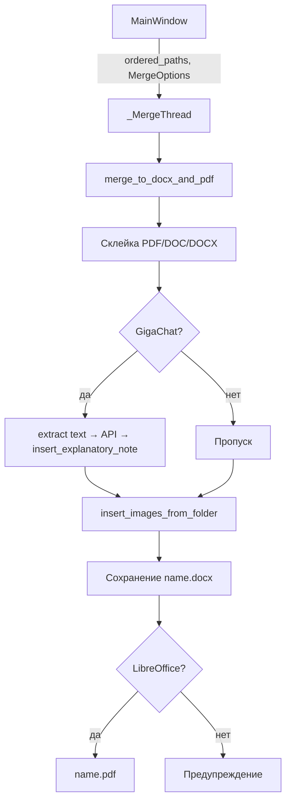

# GEO Documents

Десктопное приложение для **умной склейки отчётных материалов** геологических изысканий (ИГИ, геоотчёты) в один документ DOCX с пояснительной запиской от GigaChat. Ориентировано на типовую структуру отчётов: нумерованные разделы (`1.2`, `1.4.1`), приложения по буквам (`А.`, `Г.3`), графика `3.N`.

Приложение автоматически упорядочивает файлы, нормализует альбомные страницы под книжную ориентацию, формирует выжимку через ИИ и дополняет документ изображениями и чертежами из той же папки.

---

## Функциональность

| Возможность | Описание |
|-------------|----------|
| **Сканирование папки** | Поиск файлов `.pdf`, `.doc` и `.docx` (временные `~$*` игнорируются) |
| **Управление порядком** | Drag-and-drop, кнопки «вверх / вниз», ручное добавление и удаление файлов |
| **Автосортировка** | Сортировка имён по правилам отчётной нумерации (см. `file_sorter.py`) |
| **Склейка PDF / DOC / DOCX** | Объединение выбранных документов в один DOCX через `docxcompose` |
| **PDF на входе** | Растеризация страниц через PyMuPDF с настраиваемым DPI |
| **Пояснительная записка** | GigaChat: раздел **2** после «Содержания»; структура 1.1–1.11 по чек-листу; только факты из источников со ссылками `[ист.: …]` |
| **Конвертация `.doc`** | Word (COM) или LibreOffice — если Word недоступен |
| **Экспорт PDF** | DOCX → PDF через LibreOffice (`soffice.exe`), путь настраивается в UI |
| **Параметры склейки** | Разрыв страницы, заголовки, DPI, экспорт PDF, вкл/выкл пояснительной записки |
| **Нормализация альбомных страниц** | Альбомные секции → книжная ориентация с уменьшением шрифтов, таблиц и изображений |
| **Вставка медиа из папки** | В конец: изображения (`.jpg`, `.png`, …) и чертежи (`.dwg`, `.dxf`) |
| **Нумерация страниц** | Вверху справа — номер по всему документу; внизу справа — номер внутри текущего файла-блока |
| **Фоновая склейка** | Длительная операция в `QThread`, UI не блокируется |

### Результат работы

- **`{имя}.docx`** и **`{имя}.pdf`** сохраняются в **выбранной папке**
- В DOCX: документы по порядку → **пояснительная записка (п. 2) после «Содержания»** → приложения с фото/чертежами
- Имя по умолчанию: `merged_report`
- Без LibreOffice создаётся только DOCX (предупреждение в диалоге)
- Без GigaChat или текста в файлах записка пропускается (предупреждение, склейка продолжается)

### Ограничения

- **GigaChat** — нужен доступ к API (`http://91.146.28.240:8041`); для PDF-сканов текст может быть пустым
- **`.doc`** — Word или LibreOffice (Windows)
- **PDF на выходе** — LibreOffice
- **DWG/DXF** — ODA FileConverter, AutoCAD или FreeCAD (иначе заглушка)

---

## GigaChat и промпты

### Серверный system prompt

Эндпоинт `GET /api/gigachat/system-prompt` возвращает **общий** промпт («умный помощник», программирование, анализ данных). Для геоотчётов он **недостаточно специализирован** — его стоит обновить на стороне сервера.

### Промпт приложения

Клиентский промпт в `gigachat.build_explanatory_note_prompt()` задаёт структуру типового ИГИ:

- заголовок «1. Пояснительная записка по инженерно-геологическим изысканиям»;
- разделы 1.1–1.10.8 (введение, изученность, условия, методика, геология, грунты, выводы, рекомендации);
- каждый абзац со ссылкой на «Источник N» (файл из списка склейки);
- запрет на факты вне исходных материалов;
- `maxTokens: 100000`.

Полная математическая гарантия отсутствия «галлюцинаций» ИИ невозможна — модель может ошибиться. Для PDF-сканов без текстового слоя извлекаемый текст пуст, и записка может быть неполной.

Этот промпт **компенсирует** общий server prompt. Основная логика качества — в нём, а не в system prompt сервера.

---

## Технологии

| Компонент | Назначение |
|-----------|------------|
| **Python 3.12+** | Язык и рантайм |
| **PyQt6** | GUI |
| **python-docx** | Создание и изменение DOCX |
| **docxcompose** | Объединение DOCX (`Composer`) |
| **PyMuPDF (fitz)** | PDF: растеризация и извлечение текста |
| **Pillow** | PNG-заглушки для чертежей |
| **GigaChat API** | Пояснительная записка |
| **Microsoft Word (COM)** | Конвертация `.doc` (приоритет) |
| **LibreOffice** | `.doc` fallback и экспорт PDF |
| **PyInstaller** | Сборка `GEO_Documents.exe` |

---

## Архитектура

```text
launcher.py
geo_documents/
  main.py           # QApplication, MainWindow
  window.py         # UI, MergeOptions, QThread
  merger.py         # merge_to_docx_and_pdf, конвертеры, вставка записки
  gigachat.py       # call_simple, build_explanatory_note_prompt
  file_sorter.py    # автосортировка имён
  libreoffice.py    # find_soffice, doc_to_docx, docx_to_pdf
```

### Поток склейки



---

## Установка и запуск

### Требования

- Windows 10/11
- Python 3.12+
- Сеть до GigaChat API (для пояснительной записки)
- Word или LibreOffice — для `.doc`
- LibreOffice — для PDF
- Опционально: ODA / AutoCAD / FreeCAD — для чертежей

```powershell
cd путь\к\geo_project
python -m venv .venv
.\.venv\Scripts\pip install -r requirements.txt
.\.venv\Scripts\python.exe -m geo_documents
```

### Сборка exe

```powershell
.\build_windows.bat
```

Итог: **`dist\GEO_Documents.exe`**

---

## Структура репозитория

```text
geo_project/
├── geo_documents/
│   ├── main.py
│   ├── window.py
│   ├── merger.py
│   ├── gigachat.py
│   ├── file_sorter.py
│   └── libreoffice.py
├── launcher.py
├── GEO_Documents.spec
├── build_windows.bat
├── requirements.txt
└── README.md
```

---

## Лицензия

Уточните лицензию в репозитории на GitHub, если файл `LICENSE` отсутствует локально.
